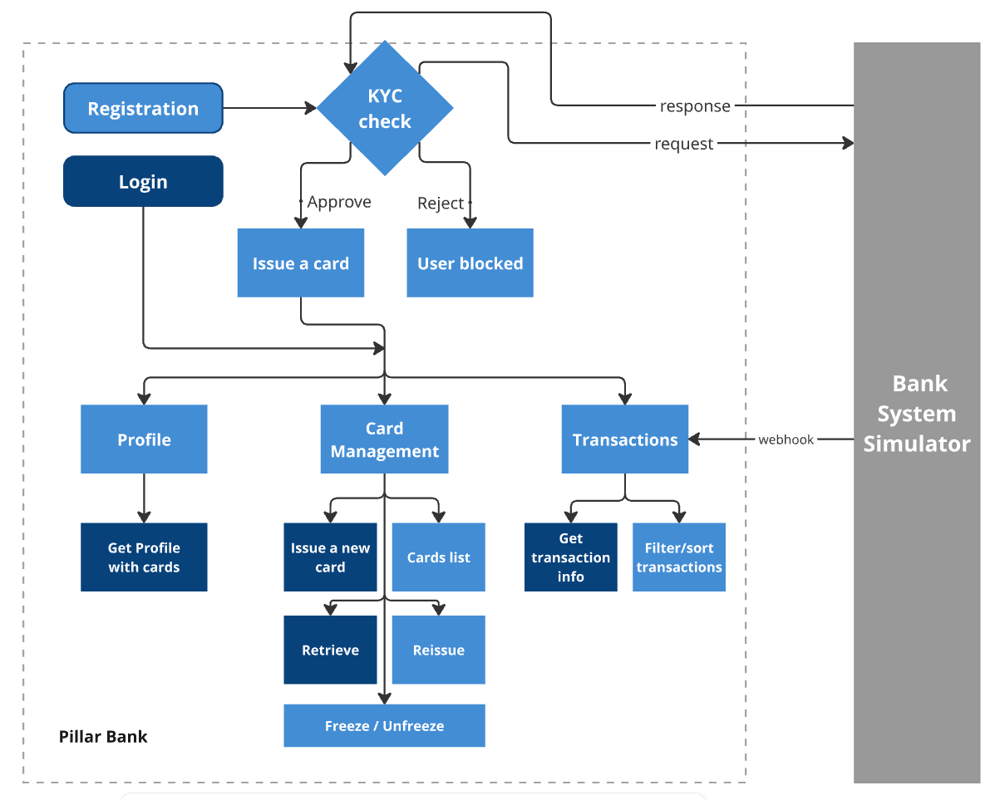

# Pillar Bank - backend

Pillar Bank is a simulated banking application that interacts with a bank simulator to perform KYC checks, issue cards, and receive transactions via webhooks.

## Project Setup
```
docker compose up --build
```

Set the following values in .env and .env.testing:  

```
KYC_SECRET_KEY=
KYC_URL=
WEBHOOK_TRANSACTION_TOKEN_PILLARBANK_SECRET=
```

KYC_URL: [Bank System Simulator](https://github.com/artengin/Bank-simulator-laravel)

## Features  

### 🔐 User Authentication & KYC  

- User registration and KYC verification via external Bank Simulator  
`POST /registration`  

- JWT-based user authentication  
`POST /login`  
  
- Retrieve authenticated user's profile and linked cards  
`GET /profile?with[]=cards`


### 💳 Card Management  

- Issue a new bank card  
`POST /cards`

- Get information about a specific card  
`GET /cards/{id}`  

- Filter and sort user cards  
`GET /cards?order_by=id&desc=0`  

- Reissue a card by ID  
`POST /card/{id}/reissue`  
  
- Freeze a card by ID  
`PUT /cards/{id}/freeze`  

- Unfreeze a card by ID  
`PUT /cards/{id}/unfreeze`


### 💸 Transactions  

- Receive and process transaction webhooks  
`POST /webhook/transactions`  

- A queued job is triggered to save the transaction to the database and update balances.  
The job runs in the background and doesn’t block the main request flow.  

- Get transaction details by ID  
`GET /transactions/{id}`

- Retrieving a list of transactions for the authenticated user  
`GET /transactions?card_id=1`

